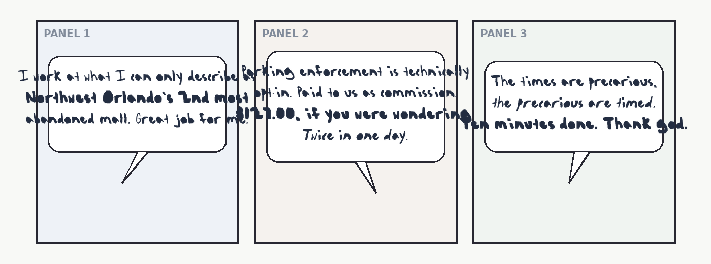

# GraphicNovelSans (comicfont)

A specialized font creation library and toolchain designed for **comic book artists, cartoonists, and letterers** to quickly turn their natural hand-drawn lettering into a complete, publication-ready **4-style TrueType / WOFF2 font family**.

It features the flagship reference typeface **BLUE175 Hand**, traced directly from the original hand-lettering in the 15-page graphic novel *BLUE175* by Justin Severn.



---

## Why GraphicNovelSans for Comic Artists?

Existing font creation tools fail cartoonists in two distinct ways:
- **Node-by-Node Vector Editors** (FontForge, Glyphs) require manually plotting hundreds of Bézier control points and spending days manually kerning pairs.
- **Grid Template Tools** (Calligraphr, YourFonts) force cartoonists to letter inside cramped rectangular boxes on a printed grid, destroying natural handwriting rhythm, baseline drift, and slant.

**GraphicNovelSans** solves this with an end-to-end algorithmic pipeline:

1. **Lettering Templates & Freeform Extraction**: Draw into printable / Procreate / Clip Studio Paint templates or harvest directly from comic dialogue speech balloons.
2. **Curvature-Sensitive Bézier Tracing**: Distinguishes pen nib corners from smooth curves based on turning angle (`52°`), preserving authentic hand texture without faceted polygons.
3. **Automated Derived Styles**:
   - **True Bold via Counter-Preserving Dilation**: Thickens strokes in pixel space while protecting interior counter holes (so `8`, `e`, `o`, `B` never flood shut).
   - **True Italic via Slant Calibration**: Measures the artist's natural handwriting slant (even if backhand) and shears to a readable, intentional forward italic angle.
4. **Band-Gap Kerning Engine**: Slices adjacent glyph silhouettes into 40 horizontal bands. Automatically balances sidebearings and generates 500–900 kerning pairs in seconds.
5. **Missing Glyph Synthesis**: Automatically creates missing rare characters (`q` from mirrored `p`, `)` from `(`, `"` from `' '`, `;` from `.`+`,`, and dots undotted `j`s).
6. **Dual-Table Packaging**: Produces TrueType (`.ttf`) and Web Open Font (`.woff2`) formats with both modern OpenType `GPOS` PairPos and legacy format-0 binary `kern` tables.

---

## Quickstart

### 1. Installation

```bash
git clone https://github.com/pinklightultra/GraphicNovelSans.git
cd GraphicNovelSans
pip install -e .
```

This installs both the Python library `graphicnovelsans` and the CLI shortcuts `comicfont` and `graphicnovelsans`.

---

### 2. CLI Workflow (Two Commands)

#### Step 1: Generate a Lettering Sheet Template
```bash
comicfont template --output lettering_sheet.png --all-caps
```
*Open `lettering_sheet.png` in Procreate, Clip Studio Paint, Photoshop, or print it out. Letter each character with dark ink into its designated cell.*

#### Step 2: Build the Complete 4-Style Font Family
```bash
comicfont build lettering_sheet.png --name "MyComicHand" --out ./output_fonts/
```
Outputs:
- `MyComicHand.ttf` & `MyComicHand.woff2` (Regular: 400 weight, upright)
- `MyComicHand-Bold.ttf` & `MyComicHand-Bold.woff2` (Bold: 700 weight, dilated)
- `MyComicHand-Italic.ttf` & `MyComicHand-Italic.woff2` (Italic: 400 weight, slant-corrected)
- `MyComicHand-BoldItalic.ttf` & `MyComicHand-BoldItalic.woff2` (Bold Italic: 700 weight)

---

### 3. Python API

```python
from graphicnovelsans import ComicFont

# Initialize font project
font = ComicFont(family_name="Kapow Sans", designer="Your Name")

# Option A: Load from a filled lettering template
font.load_lettering_sheet("my_lettering_sheet.png", all_caps=True)

# Option B: Add individual character crops / masks
# font.add_glyph("A", "path_to_A_crop.png")

# Auto-synthesize any missing characters (q, ), ", ;, etc.)
font.synthesize_missing()

# Build desktop TTF and web WOFF2 for all 4 styles
font.build(output_dir="./dist", styles=["Regular", "Bold", "Italic", "Bold Italic"])
```

---

## Comic Examples (Featuring *BLUE175*)

The [`examples/`](examples/) directory includes ready-to-run examples built on Justin Severn's graphic novel *BLUE175*:

- **[`examples/comic_panel_demo.py`](examples/comic_panel_demo.py)**: Typesets *BLUE175* dialogue directly into speech balloons across a 3-panel comic strip with HarfBuzz pair kerning and style switching.
  ```bash
  python3 examples/comic_panel_demo.py
  # Generates examples/blue175_comic_strip.png
  ```
- **[`examples/lettering_sheet_harvest.py`](examples/lettering_sheet_harvest.py)**: Simulates the complete template-to-font pipeline: generating a template, filling it with lettering, harvesting glyphs, and compiling a 4-style family.
  ```bash
  python3 examples/lettering_sheet_harvest.py
  ```
- **[`examples/quickstart.py`](examples/quickstart.py)**: Minimal end-to-end Python API demonstration.

---

## Flagship Implementation: BLUE175 Hand

The repository houses the full upstream package [`blue175-hand/`](blue175-hand/) for **BLUE175 Hand**:

- **75 characters** (`A-Z`, `a-z`, `0-9`, ` .,:;?!'\"()$-` and space)
- **67 direct ink cuts** from 15 comic pages + **7 synthesized glyphs**
- **4 linked styles**: Regular, Bold, Italic, Bold Italic
- **4.12% pooled Character Error Rate (CER)** across 6 independent Claude vision blind reads (with **0.0% error rate on standard English prose**)
- Shipped desktop TrueType fonts in [`blue175-hand/fonts/ttf/`](blue175-hand/fonts/ttf/) and web fonts in [`blue175-hand/fonts/woff2/`](blue175-hand/fonts/woff2/)
- In-browser interactive test bench: [`blue175-hand/fonts/editor.html`](blue175-hand/fonts/editor.html)

---

## Testing & Quality Assurance

Run the test suite across both the library and the flagship font package:

```bash
# Run new library unit & integration tests
pytest tests/

# Run BLUE175 Hand verification test suite
pytest blue175-hand/tests/
```

---

## License

MIT License covering both the software library and the resulting font deliverables.