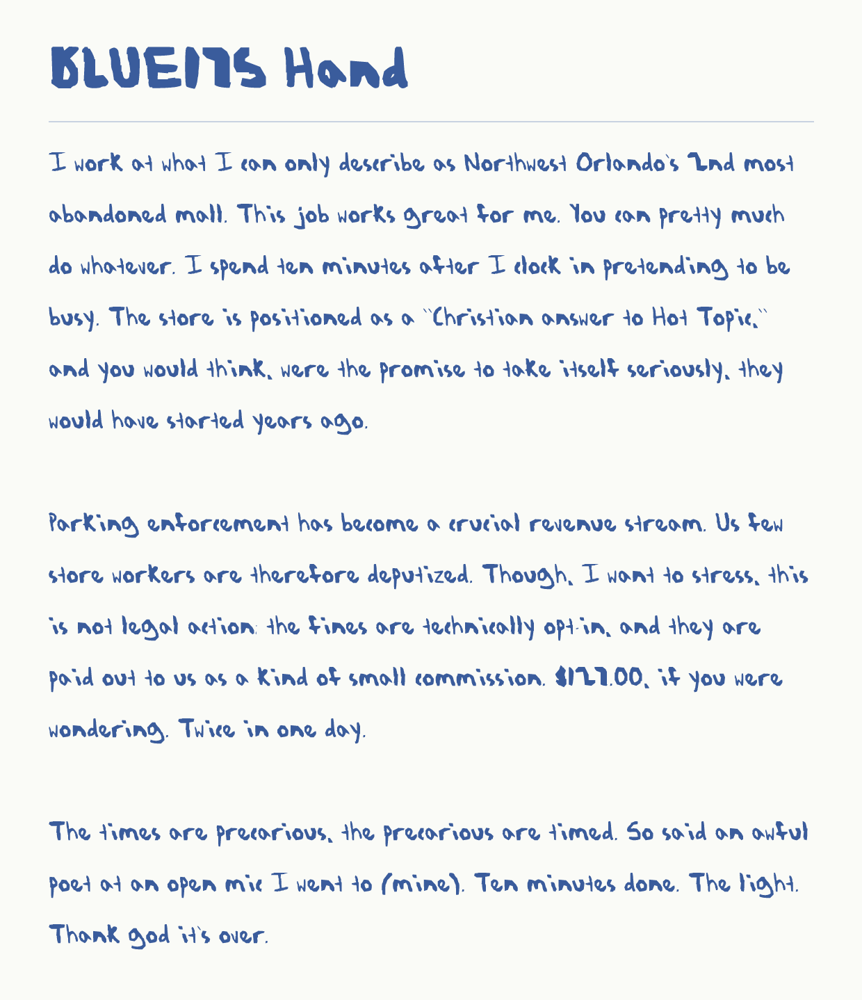

# BLUE175 Hand

A four-style handwriting typeface traced from the hand-lettering in *BLUE175*, a
fifteen-page comic, and the pipeline that made it.

Every glyph comes from the pages, and no third-party font was used as a source.
67 glyphs are traced from the ink. The other 7 are built from another glyph because
the source has no clean instance: `X` and `z` are copies, `q` and `)` are mirrors,
`"` is a pair, `;` is a stack and `j` gets a dot. The build re-cuts each glyph from
the page rather than from a saved crop. A rebuild from the pages reproduces the
shipped fonts table for table.



## Using the fonts

`fonts/ttf/` holds the four desktop styles: Regular, Bold, Italic and Bold Italic.
Install all four. They share the family name "BLUE175 Hand", so bold and italic
come from the B and I buttons. An application that was already running when you
installed them may list the name but draw a substitute face; restart it.
`fonts/editor.html` checks whether the installed font is really the one being
drawn.

`fonts/woff2/` holds the same fonts for the web. Declare all four under one family,
so the browser uses the real bold and italic instead of faking them:

```css
@font-face { font-family: "BLUE175 Hand"; src: url("woff2/BLUE175.woff2") format("woff2");
             font-weight: 400; font-style: normal; font-display: swap; }
@font-face { font-family: "BLUE175 Hand"; src: url("woff2/BLUE175-Bold.woff2") format("woff2");
             font-weight: 700; font-style: normal; font-display: swap; }
@font-face { font-family: "BLUE175 Hand"; src: url("woff2/BLUE175-Italic.woff2") format("woff2");
             font-weight: 400; font-style: italic; font-display: swap; }
@font-face { font-family: "BLUE175 Hand"; src: url("woff2/BLUE175-BoldItalic.woff2") format("woff2");
             font-weight: 700; font-style: italic; font-display: swap; }
```

## What to expect from it

The font has 75 characters: `A-Z a-z 0-9 . , ; : - ? ! ' " ( ) $` and space.
Anything else falls through to the next font in the stack.

Kerning is stored twice: in GPOS, and again in a legacy `kern` table for
applications that only read that. Each style has 639 to 877 pairs. Most of the
spacing lives in each glyph's own sidebearings, which are measured from its edge
profile, so ordinary words barely move. The table only fixes the two extremes:
pairs whose ink would touch, and pairs with a gap that no sidebearing can reach.

The italic is a second cut, not a slant of the Regular. The hand already leans
about 6° backwards, so a plain oblique does not read as italic. The italic is
sheared about 16° instead, to land at an apparent 11°.

Five digits the source cannot fix. The hand wrote these this way:

- `5` is the same letterform as `S`. Both 5s in fifteen pages are drawn as an S.
- `8` reads as `b`. The source is 16 × 24 pixels with a solid upper bowl.
- `3` reads like `B`.
- `1` is a bare stroke, the same as `l` and `I`.
- `0` and `O` are each one closed loop.

Prose reads fine. Bare strings of digits, like account and phone numbers, want a
different face.

## How legible it is

`legibility/blindtest.png` is a 15-line test sheet. It mixes sentences, pangrams,
random syllables and the pairs a hand-cut font tends to collapse (`I l 1`, `O 0`,
`S 5`, `Z 2`), with the last lines in Bold, Italic and Bold Italic. Six
independent readers transcribed it. Each was a Claude vision session given only
the image and barred from every other file. Their character error rates were:

| read | CER |
|---|---|
| `final_indep2` | 2.84% |
| `final_indep3` | 4.18% |
| `final_indep1`, `ship_read2` | 4.35% |
| `ship_read1`, `ship_read3` | 4.52% |
| **pooled** | **4.12%** (148 of 3,588 characters) |

The reads were taken before the final build, so a test proves the sheet
regenerates pixel for pixel from the shipped fonts.

The digit picks were made the same way, as A/B rounds (`ab.py`, `solo.py`). The
docstrings record what went wrong along the way. Readers settle on one reading per
shape and apply it down the sheet. A two-font sheet flatters both fonts. A
digits-only sheet and a prose sheet disagree about which `2` is better. Their
absolute rates are not comparable with the prose sheet's.

## The pipeline

```
pipeline/
  paths.py        where everything is read from and written to
  glyphlab.py     ink by the red channel, connected components, lines, contact sheets
  strip.py        a source block at zoom with its components numbered, to name letters
  candsheet.py    every plausible instance of each character side by side
  probe.py        the exact mask `cut` extracts for a manifest entry
  picksheet.py    digit candidates as ink, then built and set at reading size
  audit.py        each chosen glyph's source pixels under the character it became
  build.py        picks -> outlines -> placement, spacing, kerning, Bold, Italic -> TTF + WOFF2
  kern.py         kerning from band-by-band edge profiles
  render.py       HarfBuzz shaping, so proofs show the kerning that ships
  proof.py, specimen.py, family.py, sample_doc.py    read-back sheets and a Word test file
  blindsheet.py, score.py, ab.py, abscore.py, solo.py    legibility tests and scoring
data/             hand-made selections: which ink on which page is which letter
legibility/       the test sheet, its answer keys, and every recorded blind read
fonts/            the shipped fonts
```

Automatic labelling from a transcript got the glyph bank close (`bank_auto.json`),
but its labels were too unreliable to build from. So each glyph is chosen by hand.
`data/picks.json` addresses the ink in the manifests: page, box and component ids.
The build cuts that ink from the page again. It places each glyph by character
class, so one bad x-height estimate cannot tilt a whole line. It gets Bold by
dilating the ink and Italic by shearing it.

The source pages are not in this repo. To rebuild, point `BLUE175_PAGES` at a
folder holding `p01.webp` to `p15.webp` (1600 × 2129):

```
pip install -r requirements.txt
BLUE175_PAGES=/path/to/pages python pipeline/build.py      # -> out/
```

Everything a run writes goes to `out/` (or `BLUE175_OUT`). Run before anything has
been built, the proof and scoring scripts use the committed fonts and reads, so
`python pipeline/specimen.py` and `python pipeline/score.py ship_read1.json` work on
a fresh clone.

## Tests

```
pip install -r requirements.txt pytest
python -m pytest
```

The tests check the shipped fonts: style linking, charset, both kern tables, and
that the WOFF2 files hold the same glyphs. They also check shaping, band kerning,
ink separation, and that the recorded reads score as published. With
`BLUE175_PAGES` set, they also rebuild all four styles and compare them with the
shipped fonts, table for table.

## License

MIT, for the code and the fonts.
